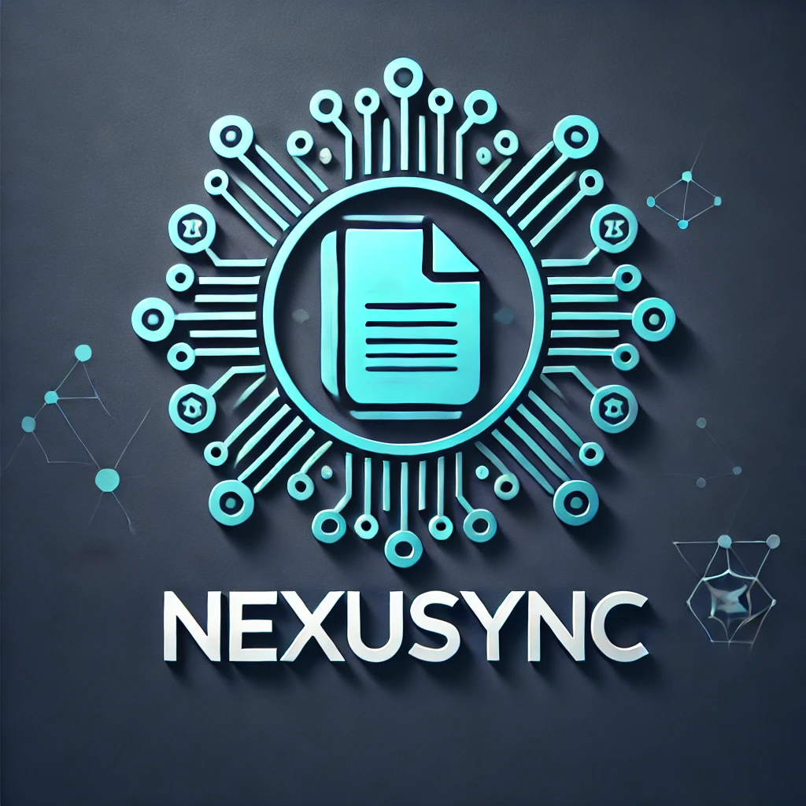

# NexuSync

NexuSync is a powerful document indexing and querying tool built on top of LlamaIndex. It allows you to efficiently manage, search, and interact with large collections of documents using advanced natural language processing techniques.

<p align="center">
  
</p>

## Features

- **Smart Document Indexing**: Automatically index documents from specified directories, keeping your knowledge base up-to-date.
- **Efficient Querying**: Use natural language to query your document collection and get relevant answers quickly.
- **Upsert Capability**: Easily update/insert new documents or remove documents from the index without rebuilding from scratch. Use `refresh_index`.
- **Chat Interface**: Engage in conversational interactions with your document collection, making information retrieval more intuitive.
- **Flexible Embedding Options**: Choose between OpenAI and HuggingFace embedding models to suit your needs and constraints.
- **Streaming Responses**: Get real-time, token-by-token responses for a more interactive experience.

## Installation

To install NexuSync, run the following command:

```bash
pip install nexusync
```

## Quick Start

Here's a simple example to get you started with NexuSync:

```python
from nexusync import NexuSync
from nexusync.models import set_embedding_model, set_language_model

# Set up open-source models from ollama
set_embedding_model(huggingface_model="BAAI/bge-base-en-v1.5")
set_language_model(ollama_model="llama3.2", temperature=0.4)

# Set up models for openai models
set_embedding_model(openai_model="text-embedding-ada-002")
set_language_model(openai_model="gtp-4o-mini", temperature=0.4)

# Initialize NexuSync
ns = NexuSync(input_dirs=["path/to/your/documents"])

# Perform a query
response = ns.query("What is the capital of France?")
print(response['response'])
```

For more detailed usage examples, check out our [demo notebook](./examples/nexusync-demo.ipynb).

## Documentation

For full documentation, visit our [documentation site](https://nexusync.readthedocs.io/).

## Contributing

We welcome contributions! Please see our [contributing guidelines](CONTRIBUTING.md) for more details.

## License

NexuSync is released under the [MIT License](LICENSE).

## Support

If you encounter any issues or have questions, please [file an issue](https://github.com/yourusername/nexusync/issues) on our GitHub repository.

## Citation

If you use NexuSync in your research, please cite it as follows:

```bibtex
@software{nexusync2024,
  author = {Your Name},
  title = {NexuSync: Efficient Document Indexing and Querying},
  year = {2024},
  url = {https://github.com/yourusername/nexusync}
}
```

## Acknowledgements

NexuSync is built on top of [LlamaIndex](https://github.com/jerryjliu/llama_index) and uses various open-source libraries. We're grateful to the developers of these projects for their contributions to the community.
